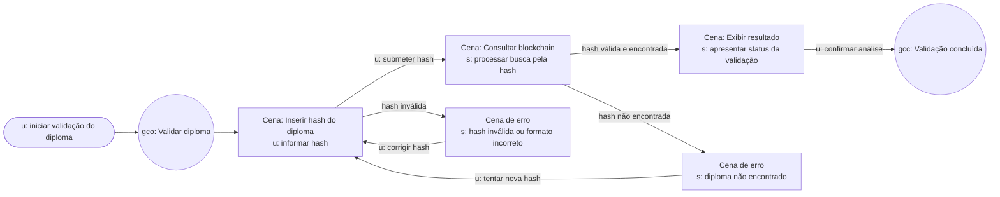

### Diagrama MoLIC — Validação de Diploma por Hash  
**Persona:** Ana Carolina Ferreira | **Responsável:** Thales Clemente Pasquotto  

```mermaid
flowchart LR
    %% Abertura de conversa
    U0([u: iniciar validação do diploma])
    GCO((gco: Validar diploma))

    %% Cena principal
    C1["Cena: Inserir hash do diploma\nu: informar hash"] 
    C2["Cena: Consultar blockchain\ns: processar busca pela hash"] 
    C3["Cena: Exibir resultado\ns: apresentar status da validação"]

    %% Cena de erro
    E1["Cena de erro\ns: hash inválida ou formato incorreto"]
    E2["Cena de erro\ns: diploma não encontrado"]

    %% Encerramento
    GCC((gcc: Validação concluída))

    %% Fluxo principal
    U0 --> GCO --> C1
    C1 -->|u: submeter hash| C2
    C2 -->|hash válida e encontrada| C3
    C3 -->|u: confirmar análise| GCC

    %% Fluxos alternativos (rupturas)
    C1 -->|hash inválida| E1
    E1 -->|u: corrigir hash| C1

    C2 -->|hash não encontrada| E2
    E2 -->|u: tentar nova hash| C1
```
