### Diagrama MoLIC — Validação de Diploma por Hash  
**Persona:** Ana Carolina Ferreira | **Responsável:** Thales Clemente Pasquotto  

---

### Diagrama MoLIC — Emissão de Diplomas em Lote
**Persona:** Maria Eduarda Santos (Analista de Emissão de Diplomas) | **Responsável:** Leandro de Brito Alencar

```mermaid
flowchart LR
    %% Abertura de conversa
    U0([u: iniciar emissão em lote])
    GCO((gco: Emitir diplomas em lote))

    %% Cenas do fluxo principal
    C1["Cena: Importar arquivo de formandos
u: fornecer arquivo CSV
s: confirmar recebimento"]

    C2["Cena: Validar dados do arquivo
s: analisar formato e campos obrigatórios
s: apresentar registros válidos e inconsistências"]

    C3["Cena: Tratar inconsistências
u: separar pendências ou corrigir agora"]

    C4["Cena: Revisar e confirmar lote
s: apresentar resumo por curso e dados do lote
u: confirmar operação"]

    C5["Cena: Processar na blockchain
s: registrar diplomas
s: exibir progresso do processamento"]

    C6["Cena: Relatório e notificação
s: exibir resultado por registro
s: enviar notificações automáticas aos formandos"]

    C7["Cena: Corrigir pendências
u: acessar fila de pendências
u: corrigir campos indicados
u: confirmar emissão dos pendentes"]

    %% Cenas de erro (rupturas)
    E1["Cena de erro
s: arquivo inválido ou formato incompatível"]

    E2["Cena de erro
s: todos os registros com inconsistências"]

    E3["Cena de erro
s: falha no registro blockchain"]

    %% Encerramento
    GCC((gcc: Emissão e notificação concluídas))

    %% Fluxo principal
    U0 --> GCO --> C1
    C1 -->|u: enviar arquivo| C2
    C2 -->|há registros válidos| C3
    C3 -->|u: confirmar seleção| C4
    C4 -->|u: confirmar emissão| C5
    C5 -->|processamento concluído| C6
    C6 -->|sem pendências| GCC

    %% Fluxo de pendências
    C6 -->|há registros pendentes| C7
    C7 -->|u: emitir pendentes| C5
    C7 -->|u: encerrar sem emitir pendentes| GCC

    %% Rupturas
    C2 -->|arquivo inválido| E1
    E1 -->|u: enviar arquivo corrigido| C1

    C2 -->|todos os registros inválidos| E2
    E2 -->|u: cancelar e revisar dados| GCO

    C5 -->|falha no registro blockchain| E3
    E3 -->|u: tentar novamente| C5
```

