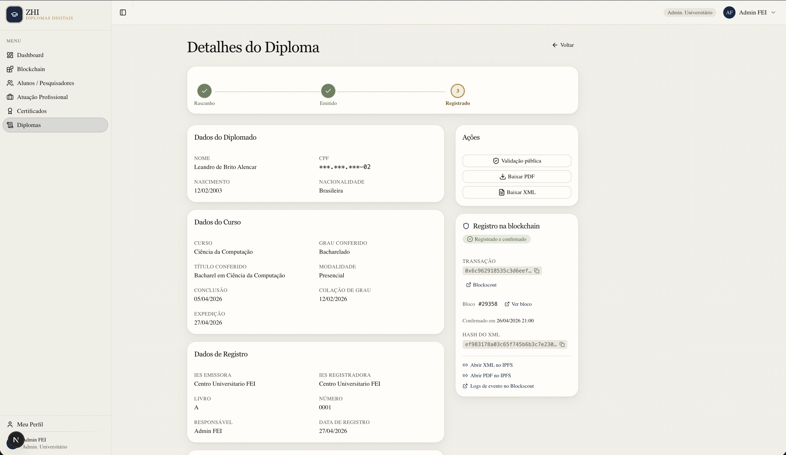
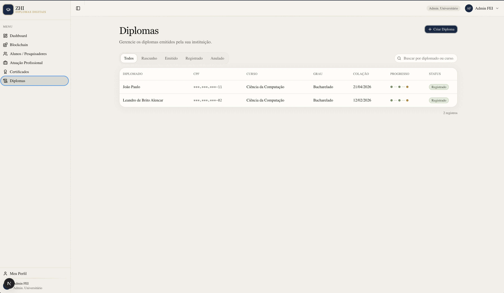
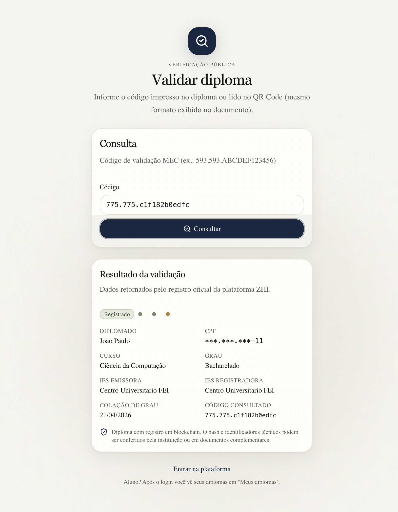
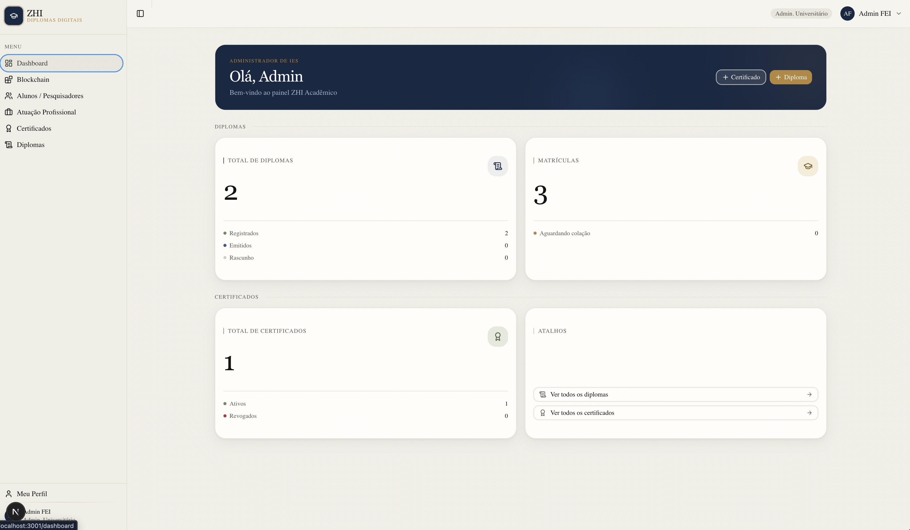
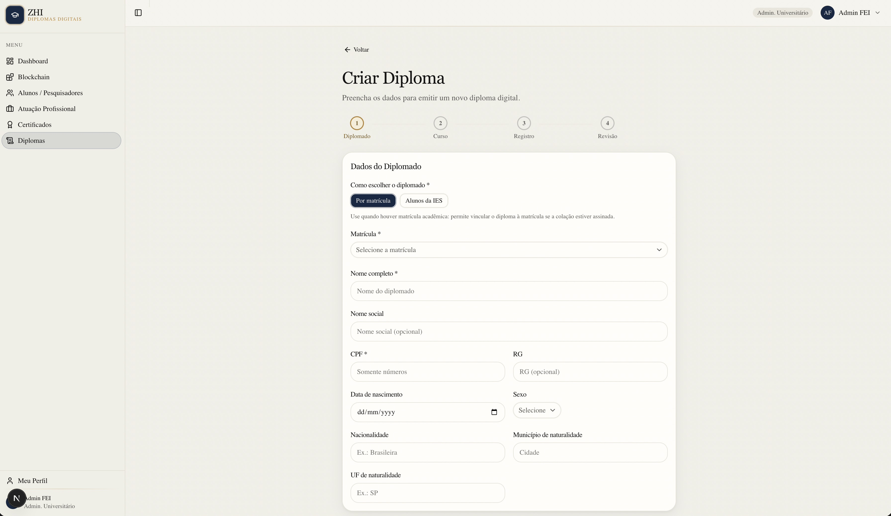

# Avaliação de IHC através de Inspeção Heurística

1. **Avaliação de IHC através de inspeção HEURÍSTICA \[1 solução completa por pessoa da equipe \- todas as telas do projeto\]**

> **_NOTE:_**: SOMENTE VIOLAÇÕES

Dez Heurísticas de Nielsen

**Descrição da avaliação**

Avaliação heurística, definida por Nielsen e Molich (1994), é um método de avaliação de usabilidade onde um avaliador procura problemas de usabilidade numa interface com o usuário através da análise e interpretação de um conjunto de princípios ou heurísticas. Este método de avaliação é baseado no julgamento do avaliador.

1\. Primeiramente, leia e analise as dez heurísticas (ver Tabela 1).

**Tabela 1 \- Conjunto de heurísticas de Nielsen (1994)**

| 1\. | Visibilidade do status do sistema: |
| :---- | :---- |
| O sistema deve sempre manter os usuários informados sobre o que está acontecendo através de feedback apropriado, em um tempo razoável. |  |
| **2\.** | **Compatibilidade entre sistema e mundo real:** |
| O sistema deve utilizar a linguagem do usuário, com palavras, frases e conceitos familiares para ele, ao invés de termos específicos de sistemas. Seguir convenções do mundo real, fazendo com que a informação apareça em uma ordem lógica e natural. |  |
| **3\.** | **Controle e liberdade para o usuário:** |
| Estão relacionados à situação em que os usuários frequentemente escolhem as funções do sistema por engano e então necessitam de "uma saída de emergência" claramente definida para sair do estado não desejado sem ter que percorrer um longo diálogo, ou seja, é necessário suporte a *undo* e *redo*. |  |
| **4\.** | **Consistência e padrões:** |
| Referem-se ao fato de que os usuários não deveriam ter acesso a diferentes situações, palavras ou ações representando a mesma coisa. A interface deve ter convenções não-ambíguas. |  |
| **5\.** | **Prevenção de erros:** |
| Os erros são as principais fontes de frustração, ineficiência e ineficácia durante a utilização do sistema. |  |
| **6\.** |  **Reconhecimento em lugar de lembrança:** |
| Tornar objetos, ações, opções visíveis e coerentes. O usuário não deve ter que lembrar informações de uma parte do diálogo para outra. Instruções para o uso do sistema devem estar visíveis ou facilmente acessíveis. |  |
| **7\.** | **Flexibilidade e eficiência de uso:** |
| A ineficiência nas tarefas pode reduzir a eficácia do usuário e causar-lhes frustração. O sistema deve ser adequado tanto para usuários inexperientes quanto para usuários experientes. |  |
| **8\.** | **Projeto minimalista e estético:** |
| Os diálogos não devem conter informações irrelevantes ou raramente necessárias. Cada unidade extra de informação em um diálogo compete com unidades relevantes e diminui sua visibilidade relativa. |  |
| **9\.** | **Auxiliar os usuários a reconhecer, diagnosticar e recuperar erros:** |
| Mensagens de erro devem ser expressas em linguagem natural (sem códigos), indicando precisamente o erro e sugerindo uma solução. |  |
| **10\.** | **Ajuda e documentação:** |
| Mesmo que seja melhor que o sistema possa ser usado sem documentação, pode ser necessário fornecer ajuda e documentação. Tais informações devem ser fáceis de encontrar, ser centradas na tarefa do usuário, listar passos concretos a serem seguidos e não ser muito grandes. A ajuda deve estar facilmente acessível e on-line. |  |

2\. A seguir, avalie o sistema procurando possíveis problemas de usabilidade.   
3\. Quando um problema qualquer for detectado, classifique-o em uma das dez heurísticas de Nielsen, anotando o problema na tabela correspondente e atribuindo o **grau de severidade** (0 até 4\) para este problema (dado pela tabela 2\) e recomece novamente até não encontrar mais problemas de usabilidade.

**Tabela 2 \- Grau de severidade dos problemas de usabilidade**

| Grau de severidade | Tipo | Descrição |
| ----- | :---- | :---- |
| 0 | Sem importância | Não afeta a operação da interface |
| 1 | Cosmético | Não há necessidade imediata de solução |
| 2 | Simples | Problema de baixa prioridade (pode ser reparado) |
| 3 | Grave | Problema de alta prioridade (deve ser reparado) |
| 4 | Catastrófico | Muito grave, deve ser reparado de qualquer forma. |

---

## Tabela Padrão de Declaração de Violação (adotada pela equipe)

> **_NOTE:_**: Formato padrão adotado pela equipe para registro de todas as violações heurísticas encontradas.

| # | Tela / Local | Descrição da Violação | Severidade | Recomendação de Correção |
| :---: | :--- | :--- | :---: | :--- |
| — | — | — | — | — |

---

## H1 — Visibilidade do Status do Sistema

> **_NOTE:_**: **colocar o print**

| # | Tela / Local | Descrição da Violação | Severidade | Recomendação de Correção |
| :---: | :--- | :--- | :---: | :--- |
| 1 | Tela de Detalhes do Diploma — Registro na Blockchain | Ao clicar em "Registrar em Blockchain", o sistema exibe apenas um spinner genérico de carregamento sem nenhuma informação sobre o andamento do processo. O usuário (Maria Eduarda) não sabe se a operação está em curso, travada ou finalizada enquanto aguarda a confirmação da rede. | 3 | Exibir uma mensagem de status progressiva durante o registro: "Enviando para a blockchain…", "Aguardando confirmação da rede…", "Diploma registrado com sucesso!" — mantendo o usuário informado em cada etapa da operação assíncrona. |

---

## H2 — Compatibilidade entre Sistema e Mundo Real

> **_NOTE:_**: **colocar o print**

| # | Tela / Local | Descrição da Violação | Severidade | Recomendação de Correção |
| :---: | :--- | :--- | :---: | :--- |
| 1 | Tela de Detalhes do Diploma — visão da recrutadora | Após a validação, o resultado exibe o identificador da transação blockchain (ex: `0x3A4f…cB91`) como dado de confirmação da autenticidade, sem qualquer explicação contextual. O dado é irrelevante e incompreensível para a recrutadora. | 2 | Substituir ou ocultar o endereço da transação. Exibir em destaque apenas: nome do formando, curso, instituição, data de colação e o texto "Diploma autenticado e registrado na blockchain em [data]". Disponibilizar os detalhes técnicos em uma seção expansível "Ver detalhes técnicos" para quem necessitar. |

---

## H3 — Controle e Liberdade para o Usuário

> **_NOTE:_**: **colocar o print**

| # | Tela / Local | Descrição da Violação | Severidade | Recomendação de Correção |
| :---: | :--- | :--- | :---: | :--- |
| 1 | Tela de Detalhes do Diploma — Modal de Confirmação de Registro | Ao clicar em "Registrar em Blockchain" e confirmar o modal, o processamento é iniciado de forma irreversível. O texto do modal diz apenas "O diploma será registrado na blockchain e no IPFS. Esta operação pode levar alguns segundos." — sem alertar explicitamente que a operação não pode ser desfeita. A analista (Maria Eduarda) não tem ciência clara da imutabilidade da ação antes de confirmá-la. | 3 | Adicionar ao texto do modal um aviso explícito sobre a irreversibilidade: "Após confirmar, o diploma será registrado permanentemente na blockchain e não poderá ser desfeito. Você revisou todos os dados?" com botões "Cancelar" e "Confirmar definitivamente". |

---

## H4 — Consistência e Padrões

> **_NOTE:_**: **colocar o print**

| # | Tela / Local | Descrição da Violação | Severidade | Recomendação de Correção |
| :---: | :--- | :--- | :---: | :--- |
| 1 | Múltiplas telas do sistema | O sistema possui dois módulos distintos — "Diplomas" e "Certificados" — e os usa de forma intercambiável em diferentes contextos sem deixar claro ao usuário a diferença entre eles. Estudantes e analistas podem não compreender que se trata de documentos com natureza jurídica e fluxos distintos. | 2 | Definir e aplicar um glossário de termos padrão em toda a interface. "Diploma" refere-se exclusivamente ao documento de conclusão de curso de graduação (sujeito à Portaria MEC nº 554/2019); "Certificado" refere-se a outros documentos acadêmicos registrados na plataforma com fluxo e finalidade distintos. Incluir uma breve descrição de cada módulo na primeira vez que o usuário acessa. |

---

## H5 — Prevenção de Erros

> **_NOTE:_**: **colocar o print**

| # | Tela / Local | Descrição da Violação | Severidade | Recomendação de Correção |
| :---: | :--- | :--- | :---: | :--- |
| 1 | Tela de Validação de Diploma — /validar (pública, sem login) | O campo de código de validação não realiza validação em tempo real do formato digitado. A recrutadora (Ana Carolina) pode inserir uma string em formato incorreto (ex: com espaços, caracteres especiais ou tamanho errado) e só receberá feedback de erro após submeter o formulário e aguardar o processamento. | 3 | Implementar validação em tempo real (on-blur/on-change) no campo de código, verificando o formato esperado imediatamente após o usuário terminar de digitar (ex: formato "NNN.NNN.XXXXXXXXXXXXXXXX" conforme o padrão MEC). Exibir feedback visual antes da submissão. |

---

## H6 — Reconhecimento em Lugar de Lembrança

> **_NOTE:_**: **colocar o print**

| # | Tela / Local | Descrição da Violação | Severidade | Recomendação de Correção |
| :---: | :--- | :--- | :---: | :--- |
| 1 | Tela de Validação de Diploma — Resultado (/validar) | Após concluir a validação de um diploma, o resultado não persiste na tela: ao pressionar "Voltar" no navegador ou recarregar a página, o resultado é perdido e a recrutadora (Ana Carolina) precisa lembrar e reinserir o código para obter o resultado novamente. | 2 | Manter o resultado da última validação visível na tela via estado local persistido em sessionStorage, ou oferecer opção de exportar/copiar o resultado. Isso permite que a recrutadora retome o contexto sem precisar reinserir dados. |

---

## H7 — Flexibilidade e Eficiência de Uso

> **_NOTE:_**: **colocar o print**

| # | Tela / Local | Descrição da Violação | Severidade | Recomendação de Correção |
| :---: | :--- | :--- | :---: | :--- |
| 1 | Painel da Analista — Listagem de Diplomas (/diplomas) | Não há suporte a ações em massa (bulk actions) na tabela de diplomas. A analista (Maria Eduarda), que gerencia múltiplos registros, precisa executar ações (ex: anular, reenviar notificação) individualmente em cada diploma, tornando o fluxo ineficiente para usuários experientes. | 2 | Implementar seleção múltipla (checkbox) na tabela de diplomas com menu de ações em massa: "Anular selecionados" e "Exportar selecionados", seguindo padrões de interfaces de gestão como o Google Admin ou sistemas ERP. |

---

## H8 — Projeto Minimalista e Estético

> **_NOTE:_**: **colocar o print**

| # | Tela / Local | Descrição da Violação | Severidade | Recomendação de Correção |
| :---: | :--- | :--- | :---: | :--- |
| 1 | Tela de Detalhes do Diploma — /diplomas/[id] | A tela exibe simultaneamente todas as informações do diploma em uma única visão não organizada: dados do diplomado, dados do curso, dados de registro, painel de ações, painel blockchain e trilha de auditoria — sobrecarregando o usuário com informações em excesso independentemente do que ele precisa fazer. | 2 | Reorganizar o conteúdo em seções com prioridade clara: manter dados essenciais e ações visíveis no topo; mover trilha de auditoria e painel de blockchain para abas ou seções expansíveis acessadas por demanda. Isso reduz a carga cognitiva sem esconder informações importantes. |

---

## H9 — Auxiliar os Usuários a Reconhecer, Diagnosticar e Recuperar Erros

> **_NOTE:_**: **colocar o print**

| # | Tela / Local | Descrição da Violação | Severidade | Recomendação de Correção |
| :---: | :--- | :--- | :---: | :--- |
| 1 | Tela de Validação — Código não encontrado (/validar) | Quando o usuário insere um código válido em formato, mas que não corresponde a nenhum diploma registrado, o sistema exibe apenas "Nenhum diploma encontrado para este código. Confira se copiou o código completo." — sem orientar sobre outras causas possíveis ou o que fazer a seguir. | 3 | Enriquecer a mensagem de erro com contexto e orientação: "Nenhum diploma foi encontrado com este código. Possíveis causas: (1) o código foi digitado com erro — verifique os caracteres; (2) o diploma ainda não foi registrado pela instituição; (3) o documento pode não ser autêntico. Em caso de dúvida, entre em contato com a instituição emissora." |

---

## H10 — Ajuda e Documentação

> **_NOTE:_**: **colocar o print**

| # | Tela / Local | Descrição da Violação | Severidade | Recomendação de Correção |
| :---: | :--- | :--- | :---: | :--- |
| 1 | Tela de Validação Pública — /validar (primeiro acesso) | O sistema não oferece nenhum fluxo de onboarding ou tutorial para novos usuários do perfil recrutador. A recrutadora (Ana Carolina) que acessa a plataforma pela primeira vez, ao seguir um link de validação enviado por um candidato, não recebe nenhuma orientação sobre como a validação funciona ou o que o resultado significa no contexto de autenticidade de diplomas via blockchain. | 2 | Implementar um tour guiado (tooltip walkthrough) exibido no primeiro acesso, com no máximo 3 etapas: (1) "Insira o código do diploma aqui"; (2) "Clique em Consultar para verificar na blockchain"; (3) "O resultado confirma se o diploma é autêntico". Deve ser dispensável por um "x" no canto superior. |

---

2. **INDICAÇÃO DE BOAS PRÁTICAS DE HEURÍSTICA \- HEURÍSTICAS NÃO VIOLADAS \[1 solução completa por pessoa da equipe\]**

> **_NOTE:_**: **1 EXEMPLO DO SEU SISTEMA ONDE A HEURÍSTICA FOI ATENDIDA (ISSO NÃO É USADO NO MERCADO, SERVE APENAS PARA APRENDIZADO)**

---

### BP-H1 — Visibilidade do Status do Sistema

**Tela:** Tela de Detalhes do Diploma — /diplomas/[id]  
**Boa prática identificada:** A tela de detalhes do diploma exibe um componente `DiplomaStatusStepper` que representa visualmente o progresso do documento ao longo do ciclo de vida completo: Rascunho → Emitido → Registrado → Anulado. O usuário (Maria Eduarda ou Lucas) consegue identificar em qual etapa o diploma se encontra sem precisar interpretar textos técnicos, mantendo-o sempre informado do estado atual da operação.

> **_NOTE:_**: **colocar o print**

---

### BP-H2 — Compatibilidade entre Sistema e Mundo Real

**Tela:** Painel da Analista — Menu de navegação lateral  
**Boa prática identificada:** O menu de navegação utiliza terminologia familiar ao contexto acadêmico da analista (Maria Eduarda): "Diplomas", "Alunos", "Meus diplomas" — sem exposição de jargões técnicos como "smart contract", "ledger" ou "nó da rede". A organização segue a lógica do fluxo real de trabalho da secretaria acadêmica, do recebimento dos dados à emissão e correção.

> **_NOTE:_**: **colocar o print**

---

### BP-H3 — Controle e Liberdade para o Usuário

**Tela:** Wizard de Criação de Diploma — /diplomas/new  
**Boa prática identificada:** O fluxo de criação de diploma em 4 etapas (Diplomado → Curso → Registro → Revisão) oferece botão "Voltar" em todas as etapas intermediárias, permitindo que o usuário retorne à etapa anterior sem perder os dados já preenchidos. O sistema preserva o estado do formulário ao navegar entre etapas, garantindo controle total sobre o processo.

> **_NOTE:_**: **colocar o print**

---

### BP-H4 — Consistência e Padrões

**Tela:** Todos os modais de confirmação do sistema  
**Boa prática identificada:** Todos os modais de confirmação de ações críticas no sistema (emitir diploma, registrar na blockchain, anular diploma) seguem o mesmo padrão visual e estrutural: título descritivo da ação, texto explicativo das consequências, e dois botões no rodapé — "Cancelar" (estilo secundário) e "Confirmar" (estilo primário). Essa consistência reduz a curva de aprendizado e evita que o usuário cometa erros por falta de familiaridade com o padrão da interface.

> **_NOTE:_**: **colocar o print**

---

### BP-H5 — Prevenção de Erros

**Tela:** Wizard de Criação de Diploma — Etapa de Revisão  
**Boa prática identificada:** Antes de finalizar a criação do diploma, o sistema exibe uma tela de revisão completa com todos os dados informados nas etapas anteriores (dados do diplomado, do curso e de registro) para conferência. Isso permite que a analista (Maria Eduarda) identifique visualmente qualquer dado incorreto — como nome errado ou data inconsistente — antes de submeter o diploma ao sistema.

> **_NOTE:_**: **colocar o print**

---

### BP-H6 — Reconhecimento em Lugar de Lembrança

**Tela:** Tela de Validação Pública — /validar  
**Boa prática identificada:** A tela de validação pública apresenta instruções visíveis diretamente na tela sem necessidade de consultar documentação externa: o campo rotulado "Código", a descrição do formato esperado ("Código de validação MEC (ex.: 593.593.ABCDEF123456)") e o botão de ação claramente rotulado. O fluxo completo — "inserir código → consultar → ver resultado" — é compreensível em uma única visão sem que o usuário precise lembrar etapas aprendidas anteriormente.

> **_NOTE:_**: **colocar o print**

---

### BP-H7 — Flexibilidade e Eficiência de Uso

**Tela:** Sistema — Diferentes pontos de entrada por perfil de usuário  
**Boa prática identificada:** O sistema oferece diferentes níveis de complexidade de acesso por perfil: a recrutadora (Ana Carolina) acessa um fluxo simplificado de validação público sem necessidade de cadastro, com apenas 1 campo e 1 botão; o estudante (Lucas) tem uma interface pessoal de autoatendimento focada em visualização; e a analista (Maria Eduarda) tem acesso a um painel completo com recursos avançados de gestão. Cada perfil tem a complexidade adequada à sua necessidade, sem sobrecarregar os usuários menos experientes.

> **_NOTE:_**: **colocar o print**

---

### BP-H8 — Projeto Minimalista e Estético

**Tela:** Tela de Validação Pública — Resultado positivo (/validar)  
**Boa prática identificada:** A tela de resultado de uma validação bem-sucedida exibe apenas as informações essenciais para a decisão da recrutadora (Ana Carolina): nome completo do formando, CPF mascarado, curso, grau conferido, IES emissora, IES registradora e data de colação. Os dados técnicos de blockchain são apresentados em texto secundário discreto, sem competir com as informações operacionalmente relevantes.

> **_NOTE:_**: **colocar o print**

---

### BP-H9 — Auxiliar os Usuários a Reconhecer, Diagnosticar e Recuperar Erros

**Tela:** Tela de Validação Pública — Diploma anulado (/validar)  
**Boa prática identificada:** Quando o código corresponde a um diploma anulado (HTTP 410), o sistema exibe uma mensagem específica e distinta do erro 404: "Este diploma foi anulado e não pode mais ser validado como válido." — diferenciando claramente os casos de "não encontrado" e "encontrado, mas inválido", ajudando o usuário a entender o estado real do documento sem ambiguidade.

> **_NOTE:_**: **colocar o print**

---

### BP-H10 — Ajuda e Documentação

**Tela:** Tela de Validação Pública — /validar  
**Boa prática identificada:** A tela de validação pública exibe, logo abaixo do título, um texto explicativo contextual: "Informe o código impresso no diploma ou lido no QR Code (mesmo formato exibido no documento)." — orientando o usuário sobre onde encontrar o código sem que ele precise sair da página ou consultar documentação externa. A ajuda está embutida na própria interface, centrada na tarefa do usuário.

> **_NOTE:_**: **colocar o print**

