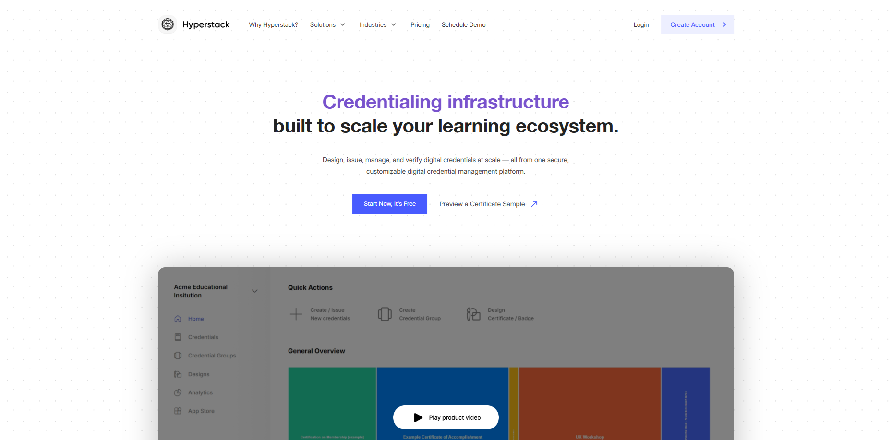
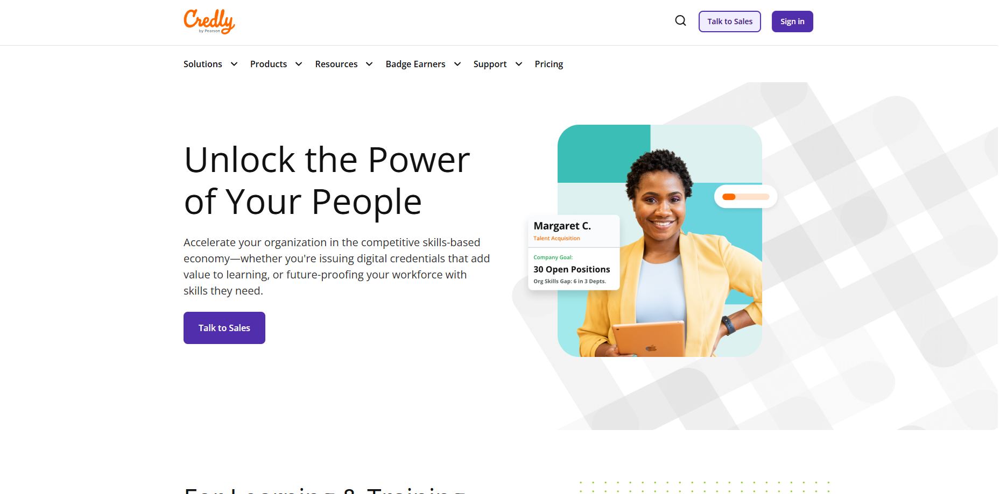

# Análise de concorrência

> **_NOTE:_**: O fator mais importante desta entrega é a equipe conseguir identificar e documentar prints de telas de interfaces concorrentes (ou interfaces representativas para o público alvo). Esses prints serão usados na fase de caracterização de padrões, affordances, heurísticas, etc. CONCORRENTE NÃO É IDÊNTICO E SIM ATUANDO NA MESMA ÁREA E/OU ATUANDO PARA O MESMO PÚBLICO ALVO.

1. Identifique os principais concorrentes mais utilizados pelo seu público-alvo.
> [Hyperstack](https://thehyperstack.com/), [Credly](https://info.credly.com/), [e-diplomas](https://e-diploma.com.br/)

  
  
Página inicial do Hyperstack

  
  
Página inicial do Credly

  
  
Página inicial do e-diploma

> 
2. Descreva as características e funcionalidades de cada concorrente.
> Geração de design dos certificados, adequação com regras locais de emissão, verificação de capacidade técnicas.
3. Colete opniões sobre a experiência do usuário (UX) de cada concorrente.
> Hyperstack você tem um studio para gerar o seu certificado como quiser, adicionar a UI que quiser para ele.
Fazer geração de diversos certificados de uma vez só.
4. Apresente os preços e modelos de negócio de cada concorrente.
> Hyperstack: Gratuito para uso limitado, pago para uso ilimitado.
Credly: Sem informações sobre preços.
e-diplomas: Sem informações sobre preços.
5. Identifique padrões e tendências no mercado.
> Padrões: Geração de design dos certificados, adequação com regras locais de emissão, verificação de capacidade técnicas.
Tendências: Geração de diversos certificados de uma vez só.
6. Elabore relatórios e sumarize os resultados.
> Observa-se que há uma forte padronização nas funcionalidades centrais dessas plataformas, como a personalização visual dos certificados, a adequação às normas e legislações locais de emissão e a verificação da autenticidade e validade dos documentos emitidos. Esses elementos configuram requisitos mínimos esperados pelo público-alvo e influenciam diretamente a percepção de confiabilidade do serviço.
> No aspecto de modelo de negócio, nota-se uma baixa transparência nas informações de preços em parte das plataformas analisadas, o que pode representar uma barreira para novos usuários no processo de decisão. O modelo freemium, identificado no Hyperstack, mostra-se uma estratégia comum para atrair usuários e demonstrar valor antes da conversão para planos pagos.
7. Extraia pontos positivos/negativos e faça recomendações.
> Pontos positivos: Geração de design dos certificados, adequação com regras locais de emissão, verificação de capacidade técnicas.
Pontos negativos: Não temos informações sobre preços.
> Recomendações: Implementar um sistema de geração de certificados de uma vez só.
