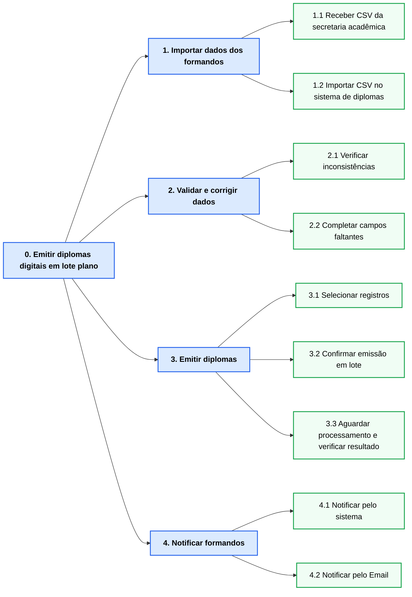
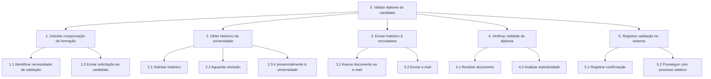
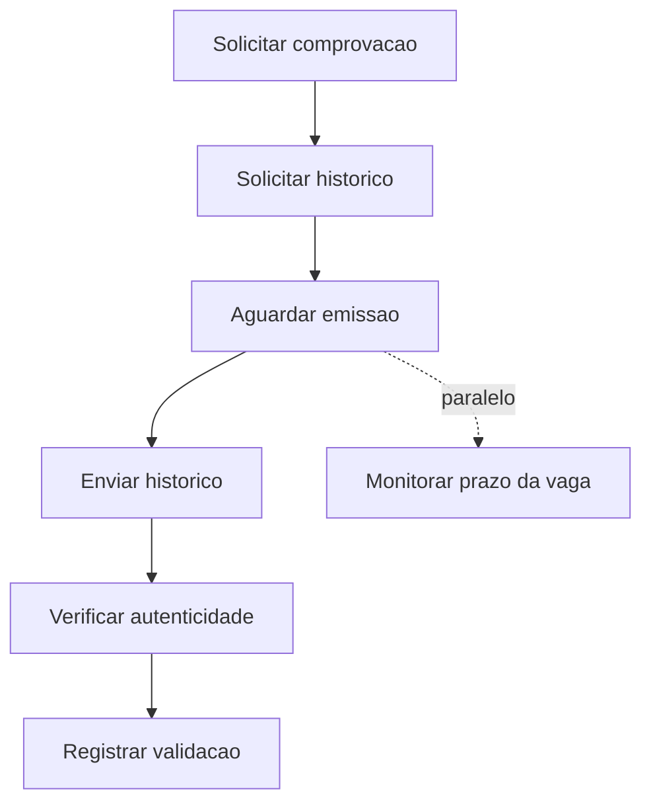

# Análise de Tarefas - Emissão de Diploma

## Análise Hierárquica de Tarefas (HTA)

**Persona:** Maria Eduarda Santos — Analista de Emissão de Diplomas
**Responsável:** Leandro de Brito Alencar
**Tarefa principal:** Emitir diplomas digitais em lote após colação de grau

---



---

### Tabela de Objetivos/Operações, Problemas e Recomendações

| Objetivos / Operações | Problemas e Recomendações |
|---|---|
| **0. Emitir diplomas digitais em lote**  <br> Input: lista de formandos homologados · Feedback: diplomas na blockchain e formandos notificados | Rec.: integrar SIGA ao sistema para eliminar a exportação manual |
| **1. Importar dados dos formandos**  | |
| 1.1 Receber arquivo CSV da secretaria acadêmica | **Problema !** Processo manual por e-mail, sem rastreabilidade de versão ou data do arquivo |
| 1.2 Importar CSV no sistema de diplomas | **Problema !** Formato do CSV do SIGA incompatível com o sistema — Maria corrige manualmente no Excel **· Rec.:** padronizar ou integrar o formato de exportação |
| **2. Validar e corrigir dados**  | |
| 2.1 Verificar inconsistências nos dados importados | **Problema !** Sem validação automática — Maria revisa 238 registros visualmente, um a um **· Rec.:** validar CPF, datas e campos críticos automaticamente na importação |
| 2.2 Completar campos obrigatórios faltantes | **Problema !** Campos obrigatórios ausentes no CSV; Maria alterna entre SIGA e sistema para transcrever dados de cada formando **· Problema !** Sessão expira sem aviso, perdendo o trabalho em andamento **· Rec.:** incluir todos os campos na exportação do SIGA; implementar salvamento automático e aviso de sessão |
| **3. Emitir diplomas**  | |
| 3.1 Selecionar registros para emissão | |
| 3.2 Confirmar emissão em lote | |
| 3.3 Aguardar processamento e verificar resultado | **Problema !** Sem barra de progresso — Maria não sabe se o sistema está travado **· Problema !** Sistema informa apenas o total emitido, sem identificar falhas; Maria compara 238 nomes manualmente **· Rec.:** exibir progresso e gerar relatório de falhas com motivo por registro |
| **4. Notificar formandos**  | |
| 4.1 Notificar via sistema de diplomas | **Problema !** Módulo de e-mail não configurado; sistema exibe erro sem orientação **· Rec.:** ativar notificação automática como etapa obrigatória do fluxo |
| 4.2 Notificar manualmente pelo Email | **Problema !** Sistema não armazena e-mail dos formandos; Maria busca cada endereço no SIGA individualmente **· Problema !** Endereços desatualizados geram devoluções descobertas só após o envio **· Rec.:** armazenar e-mails no sistema e validar antes da emissão |

---

## Modelo GOMS

**Persona:** Maria Eduarda Santos — Analista de Emissão de Diplomas
**Tarefa principal:** Emitir diplomas digitais em lote após colação de grau

> **★** = método executado no cenário atual &nbsp;|&nbsp; **⚠** = método ideal, indisponível no sistema atual

```
GOAL 0: Emitir diplomas digitais em lote após colação de grau

  GOAL 1: Obter dados dos formandos

    METHOD 1.A: Importar CSV diretamente no sistema
      (SEL. RULE: o arquivo CSV da secretaria é compatível com o sistema de diplomas)
      OP. 1.A.1: acessar o cliente de e-mail corporativo
      OP. 1.A.2: localizar o e-mail da secretaria com o CSV anexo
      OP. 1.A.3: baixar o arquivo CSV para a pasta local
      OP. 1.A.4: acessar o sistema de diplomas no navegador
      OP. 1.A.5: selecionar a opção "Importar em lote"
      OP. 1.A.6: carregar o arquivo CSV e verificar os registros importados

    METHOD 1.B: Corrigir CSV e reimportar  ★
      (SEL. RULE: o CSV do SIGA é incompatível com o sistema de diplomas)
      OP. 1.B.1: acessar o cliente de e-mail e baixar o CSV anexo
      OP. 1.B.2: abrir o arquivo CSV no Microsoft Excel
      OP. 1.B.3: identificar e corrigir as colunas com formato incompatível
      OP. 1.B.4: salvar o arquivo CSV corrigido
      OP. 1.B.5: acessar o sistema de diplomas e importar o arquivo corrigido
      OP. 1.B.6: verificar o número de registros importados

  GOAL 2: Validar e corrigir dados

    GOAL 2.1: Verificar inconsistências nos dados importados

      METHOD 2.1.A: Revisão visual manual registro a registro  ★
        (SEL. RULE: o sistema não oferece validação automática de dados)
        OP. 2.1.A.1: percorrer a lista de registros importados na tela
        OP. 2.1.A.2: identificar visualmente valores suspeitos (datas, CPF, campos em branco)
        OP. 2.1.A.3: abrir o registro, corrigir o valor e salvar
        OP. 2.1.A.4: repetir OP. 2.1.A.1–2.1.A.3 para cada um dos 238 registros

    GOAL 2.2: Completar campos obrigatórios faltantes

      METHOD 2.2.A: Preenchimento via integração SIGA  ⚠ INDISPONÍVEL
        (SEL. RULE: integração entre SIGA e sistema de diplomas está configurada)
        OP. 2.2.A.1: acionar a sincronização automática no sistema de diplomas
        OP. 2.2.A.2: confirmar que todos os campos obrigatórios foram preenchidos

      METHOD 2.2.B: Preenchimento manual alternando entre SIGA e sistema  ★
        (SEL. RULE: não há integração entre SIGA e o sistema de diplomas)
        OP. 2.2.B.1: abrir o SIGA em nova aba e buscar o aluno pelo CPF
        OP. 2.2.B.2: anotar os campos faltantes (data de ingresso, turno, habilitação)
        OP. 2.2.B.3: alternar para o sistema de diplomas e preencher os campos
        OP. 2.2.B.4: salvar o registro
        OP. 2.2.B.5: repetir OP. 2.2.B.1–2.2.B.4 para cada um dos 238 formandos

  GOAL 3: Emitir os diplomas

    GOAL 3.1: Selecionar registros para o lote

      METHOD 3.1.A: Selecionar todos de uma vez
        (SEL. RULE: todos os registros têm dados completos e válidos)
        OP. 3.1.A.1: marcar a caixa "selecionar todos" e confirmar o total

      METHOD 3.1.B: Selecionar individualmente
        (SEL. RULE: há registros com dados incompletos)
        OP. 3.1.B.1: percorrer a lista e marcar apenas os registros completos
        OP. 3.1.B.2: verificar o total de registros marcados para o lote

    GOAL 3.2: Confirmar e disparar a emissão

      METHOD 3.2.A: Confirmar pelo sistema  ★
        (SEL. RULE: registros selecionados e dados validados)
        OP. 3.2.A.1: clicar em "Emitir lote" e confirmar no diálogo
        OP. 3.2.A.2: aguardar o processamento sem indicador de progresso visível

    GOAL 3.3: Identificar falhas na emissão

      METHOD 3.3.A: Consultar relatório do sistema  ⚠ INDISPONÍVEL
        (SEL. RULE: sistema gera relatório detalhado ao concluir)
        OP. 3.3.A.1: abrir o relatório e identificar registros com falha e motivo

      METHOD 3.3.B: Comparação manual  ★
        (SEL. RULE: sistema informa apenas o total emitido, sem relatório de falhas)
        OP. 3.3.B.1: anotar o total emitido informado pelo sistema
        OP. 3.3.B.2: comparar cada formando do lote com os diplomas na blockchain
        OP. 3.3.B.3: marcar como falha os registros ausentes
        OP. 3.3.B.4: repetir OP. 3.3.B.2–3.3.B.3 para cada um dos 238 formandos

  GOAL 4: Notificar formandos sobre disponibilidade do diploma

    METHOD 4.A: Notificar via módulo do sistema  ⚠ INDISPONÍVEL
      (SEL. RULE: módulo de e-mail configurado e ativo)
      OP. 4.A.1: acionar "Notificar formandos" e confirmar envio automático

    METHOD 4.B: Notificar manualmente pelo Outlook  ★
      (SEL. RULE: módulo de e-mail indisponível no sistema)
      OP. 4.B.1: abrir o SIGA e copiar o e-mail do formando
      OP. 4.B.2: criar e enviar e-mail no Outlook com o link do diploma
      OP. 4.B.3: repetir OP. 4.B.1–4.B.2 para cada um dos 238 formandos
```

# Análise de Tarefas – Validação de Diploma

## Cenário 2
**Responsável:** Thales Clemente Pasquotto  

---

# 1. Análise Hierárquica de Tarefas (HTA)



---

## Decomposição Hierárquica

| Nº | Objetivo / Operação |
|---|---|
| **0** | Validar diploma do candidato |
| **1** | Solicitar comprovação de formação ao candidato |
| **1.1** | Identificar necessidade de validação do diploma |
| **1.2** | Enviar solicitação de histórico ou comprovação ao candidato |
| **2** | Obter histórico acadêmico da universidade |
| **2.1** | Solicitar histórico à universidade |
| **2.2** | Aguardar emissão do documento |
| **2.3** | (Opcional) Ir presencialmente à universidade para verificar solicitação |
| **3** | Enviar histórico para a recrutadora |
| **3.1** | Anexar histórico ao e-mail |
| **3.2** | Enviar e-mail solicitando confirmação de recebimento |
| **4** | Verificar validade do diploma |
| **4.1** | Receber histórico ou confirmação institucional |
| **4.2** | Analisar documento recebido |
| **5** | Registrar validação no sistema da empresa |
| **5.1** | Inserir confirmação de diploma no sistema |
| **5.2** | Prosseguir com processo seletivo |

---

## Input, Feedback e Problemas

**Input:**  
- Currículo do candidato  
- Histórico acadêmico emitido pela universidade

**Feedback:**  
- Documento validado e registrado no sistema interno da empresa

**Problemas identificados:**
- Demora na emissão do histórico pela universidade
- Dependência de comunicação manual (e-mail ou telefone)

**Recomendações:**
- Integração automática com sistema de validação de diplomas
- Plataforma digital para envio e validação de certificados

---

# 2. Modelo GOMS

## GOAL 0
Validar diploma de Lucas Mendes para continuidade do processo seletivo.

---

## GOAL 1
Solicitar comprovação de formação ao candidato.

### METHOD 1.A – Solicitação via e-mail
(SEL. RULE: empresa utiliza comunicação direta com candidato)

OP.1.A.1: abrir sistema de recrutamento  
OP.1.A.2: localizar candidato Lucas Mendes  
OP.1.A.3: redigir e-mail solicitando histórico  
OP.1.A.4: enviar e-mail

---

## GOAL 2
Obter histórico acadêmico.

### METHOD 2.A – Solicitação online
(SEL. RULE: universidade possui sistema digital)

OP.2.A.1: acessar portal da universidade  
OP.2.A.2: localizar opção de emissão de histórico  
OP.2.A.3: solicitar documento

### METHOD 2.B – Solicitação presencial
(SEL. RULE: demora superior ao prazo esperado)

OP.2.B.1: deslocar-se até a universidade  
OP.2.B.2: solicitar histórico na secretaria  
OP.2.B.3: aguardar emissão do documento

---

## GOAL 3
Enviar histórico para a recrutadora.

### METHOD 3.A – Envio por e-mail

OP.3.A.1: abrir cliente de e-mail  
OP.3.A.2: anexar histórico  
OP.3.A.3: escrever mensagem solicitando confirmação  
OP.3.A.4: enviar e-mail

---

## GOAL 4
Verificar validade do diploma.

### METHOD 4.A – Análise do documento recebido

OP.4.A.1: abrir e-mail do candidato  
OP.4.A.2: baixar histórico  
OP.4.A.3: analisar instituição e curso  
OP.4.A.4: confirmar autenticidade

---

## GOAL 5
Registrar validação no sistema.

### METHOD 5.A – Registro interno

OP.5.A.1: acessar sistema de recrutamento  
OP.5.A.2: atualizar status da documentação  
OP.5.A.3: prosseguir com processo seletivo

---

# 3. Modelo CTT (ConcurTaskTrees)



---

## Estrutura de Tarefas
Validar diploma do candidato
|
+-- Solicitar comprovação de formação (Usuário - Ana)
>>
+-- Solicitar histórico à universidade (Usuário - Lucas)
||
+-- Aguardar emissão do documento (Sistema/Universidade)
>>
+-- Enviar histórico à recrutadora (Interativa)
>>
+-- Verificar autenticidade do diploma (Usuário - Ana)
>>
+-- Registrar validação no sistema (Interativa)
