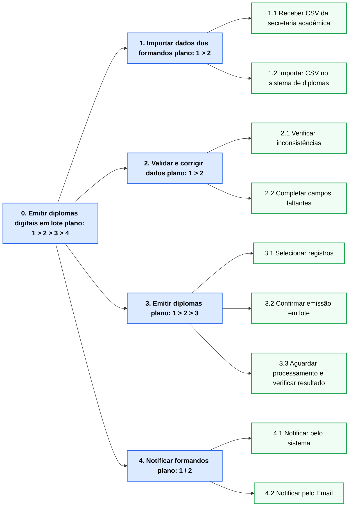
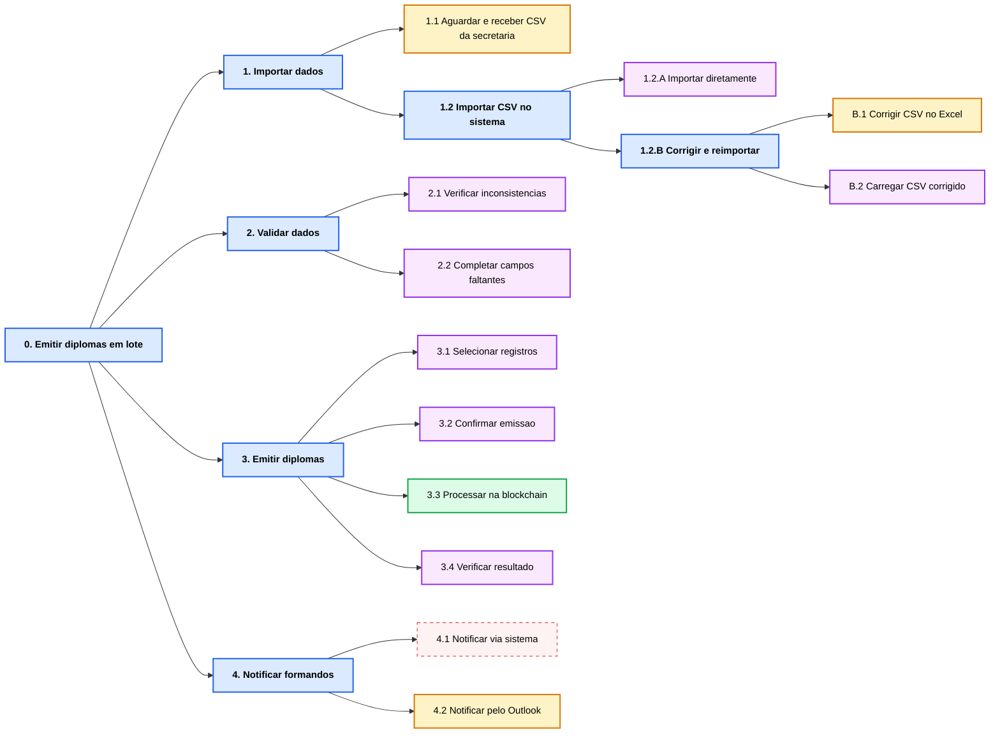
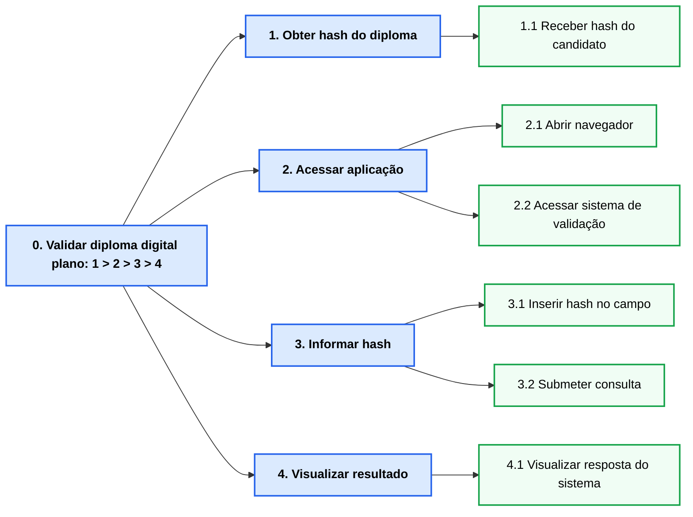
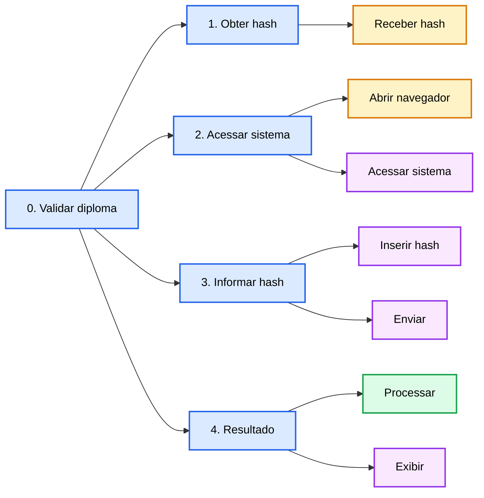

# Análise de Tarefas - Emissão de Diploma

## Análise Hierárquica de Tarefas (HTA)

**Persona:** Maria Eduarda Santos — Analista de Emissão de Diplomas

**Responsável:** Leandro de Brito Alencar

**Tarefa principal:** Emitir diplomas digitais em lote após colação de grau

---



---

### Tabela de Objetivos/Operações, Problemas e Recomendações

| Objetivos / Operações                                                                                                                                                | Problemas e Recomendações                                                                                                                                                                                                                                                                                                |
| -------------------------------------------------------------------------------------------------------------------------------------------------------------------- | ------------------------------------------------------------------------------------------------------------------------------------------------------------------------------------------------------------------------------------------------------------------------------------------------------------------------ |
| **0. Emitir diplomas digitais em lote** `plano: 1 > 2 > 3 > 4` <br> Input: lista de formandos homologados · Feedback: diplomas na blockchain e formandos notificados | Rec.: integrar SIGA ao sistema para eliminar a exportação manual                                                                                                                                                                                                                                                         |
| **1. Importar dados dos formandos**                                                                                                                                  |                                                                                                                                                                                                                                                                                                                          |
| 1.1 Receber arquivo CSV da secretaria acadêmica                                                                                                                      | **Problema !** Processo manual por e-mail, sem rastreabilidade de versão ou data do arquivo                                                                                                                                                                                                                              |
| 1.2 Importar CSV no sistema de diplomas                                                                                                                              | **Problema !** Formato do CSV do SIGA incompatível com o sistema — Maria corrige manualmente no Excel **· Rec.:** padronizar ou integrar o formato de exportação                                                                                                                                                         |
| **2. Validar e corrigir dados**                                                                                                                                      |                                                                                                                                                                                                                                                                                                                          |
| 2.1 Verificar inconsistências nos dados importados                                                                                                                   | **Problema !** Sem validação automática — Maria revisa 238 registros visualmente, um a um **· Rec.:** validar CPF, datas e campos críticos automaticamente na importação                                                                                                                                                 |
| 2.2 Completar campos obrigatórios faltantes                                                                                                                          | **Problema !** Campos obrigatórios ausentes no CSV; Maria alterna entre SIGA e sistema para transcrever dados de cada formando **· Problema !** Sessão expira sem aviso, perdendo o trabalho em andamento **· Rec.:** incluir todos os campos na exportação do SIGA; implementar salvamento automático e aviso de sessão |
| **3. Emitir diplomas**                                                                                                                                               |                                                                                                                                                                                                                                                                                                                          |
| 3.1 Selecionar registros para emissão                                                                                                                                |                                                                                                                                                                                                                                                                                                                          |
| 3.2 Confirmar emissão em lote                                                                                                                                        |                                                                                                                                                                                                                                                                                                                          |
| 3.3 Aguardar processamento e verificar resultado                                                                                                                     | **Problema !** Sem barra de progresso — Maria não sabe se o sistema está travado **· Problema !** Sistema informa apenas o total emitido, sem identificar falhas; Maria compara 238 nomes manualmente **· Rec.:** exibir progresso e gerar relatório de falhas com motivo por registro                                   |
| **4. Notificar formandos**                                                                                                                                           |                                                                                                                                                                                                                                                                                                                          |
| 4.1 Notificar via sistema de diplomas                                                                                                                                | **Problema !** Módulo de e-mail não configurado; sistema exibe erro sem orientação **· Rec.:** ativar notificação automática como etapa obrigatória do fluxo                                                                                                                                                             |
| 4.2 Notificar manualmente pelo Email                                                                                                                                 | **Problema !** Sistema não armazena e-mail dos formandos; Maria busca cada endereço no SIGA individualmente **· Problema !** Endereços desatualizados geram devoluções descobertas só após o envio **· Rec.:** armazenar e-mails no sistema e validar antes da emissão                                                   |

---

## Modelo GOMS

**Persona:** Maria Eduarda Santos — Analista de Emissão de Diplomas
**Tarefa principal:** Emitir diplomas digitais em lote após colação de grau

> **★** = método executado no cenário atual &nbsp;|&nbsp; **⚠** = método ideal, indisponível no sistema atual

```
GOAL 0: Emitir diplomas digitais em lote após colação de grau

  GOAL 1: Obter dados dos formandos (plano: 1.1 > 1.2)

    GOAL 1.1: Receber arquivo CSV da secretaria acadêmica
      OP. 1.1.1: acessar o cliente de e-mail corporativo
      OP. 1.1.2: localizar o e-mail da secretaria com o CSV anexo
      OP. 1.1.3: baixar o arquivo CSV para a pasta local

    GOAL 1.2: Importar CSV no sistema de diplomas

      METHOD 1.2.A: Importar CSV diretamente
        (SEL. RULE: o arquivo CSV é compatível com o formato do sistema)
        OP. 1.2.A.1: acessar o sistema de diplomas no navegador
        OP. 1.2.A.2: selecionar a opção "Importar em lote"
        OP. 1.2.A.3: carregar o arquivo CSV e verificar os registros importados

      METHOD 1.2.B: Corrigir CSV e reimportar  ★
        (SEL. RULE: o CSV exportado pelo SIGA é incompatível com o formato do sistema)
        OP. 1.2.B.1: abrir o arquivo CSV no Microsoft Excel
        OP. 1.2.B.2: identificar e corrigir as colunas com formato incompatível
        OP. 1.2.B.3: salvar o arquivo CSV corrigido
        OP. 1.2.B.4: acessar o sistema de diplomas no navegador
        OP. 1.2.B.5: selecionar a opção "Importar em lote"
        OP. 1.2.B.6: carregar o arquivo corrigido e verificar os registros importados

  GOAL 2: Validar e corrigir dados

    GOAL 2.1: Verificar inconsistências nos dados importados

      METHOD 2.1.A: Revisão visual manual registro a registro  ★
        (SEL. RULE: o sistema não oferece validação automática de dados)
        OP. 2.1.A.1: percorrer a lista de registros importados na tela
        OP. 2.1.A.2: identificar visualmente valores suspeitos (datas, CPF, campos em branco)
        OP. 2.1.A.3: abrir o registro, corrigir o valor e salvar
        OP. 2.1.A.4: repetir OP. 2.1.A.1–2.1.A.3 para cada um dos 238 registros

    GOAL 2.2: Completar campos obrigatórios faltantes

      METHOD 2.2.A: Preenchimento via integração SIGA  ⚠ INDISPONÍVEL
        (SEL. RULE: integração entre SIGA e sistema de diplomas está configurada)
        OP. 2.2.A.1: acionar a sincronização automática no sistema de diplomas
        OP. 2.2.A.2: confirmar que todos os campos obrigatórios foram preenchidos

      METHOD 2.2.B: Preenchimento manual alternando entre SIGA e sistema  ★
        (SEL. RULE: não há integração entre SIGA e o sistema de diplomas)
        OP. 2.2.B.1: abrir o SIGA em nova aba e buscar o aluno pelo CPF
        OP. 2.2.B.2: anotar os campos faltantes (data de ingresso, turno, habilitação)
        OP. 2.2.B.3: alternar para o sistema de diplomas e preencher os campos
        OP. 2.2.B.4: salvar o registro
        OP. 2.2.B.5: repetir OP. 2.2.B.1–2.2.B.4 para cada um dos 238 formandos

  GOAL 3: Emitir os diplomas

    GOAL 3.1: Selecionar registros para o lote

      METHOD 3.1.A: Selecionar todos de uma vez
        (SEL. RULE: todos os registros têm dados completos e válidos)
        OP. 3.1.A.1: marcar a caixa "selecionar todos" e confirmar o total

      METHOD 3.1.B: Selecionar individualmente
        (SEL. RULE: há registros com dados incompletos)
        OP. 3.1.B.1: percorrer a lista e marcar apenas os registros completos
        OP. 3.1.B.2: verificar o total de registros marcados para o lote

    GOAL 3.2: Confirmar e disparar a emissão
      OP. 3.2.1: clicar em "Emitir lote" e confirmar no diálogo
      OP. 3.2.2: aguardar o processamento sem indicador de progresso visível

    GOAL 3.3: Identificar falhas na emissão

      METHOD 3.3.A: Consultar relatório do sistema  ⚠ INDISPONÍVEL
        (SEL. RULE: sistema gera relatório detalhado ao concluir)
        OP. 3.3.A.1: abrir o relatório e identificar registros com falha e motivo

      METHOD 3.3.B: Comparação manual  ★
        (SEL. RULE: sistema informa apenas o total emitido, sem relatório de falhas)
        OP. 3.3.B.1: anotar o total emitido informado pelo sistema
        OP. 3.3.B.2: comparar cada formando do lote com os diplomas na blockchain
        OP. 3.3.B.3: marcar como falha os registros ausentes
        OP. 3.3.B.4: repetir OP. 3.3.B.2–3.3.B.3 para cada um dos 238 formandos

  GOAL 4: Notificar formandos sobre disponibilidade do diploma

    METHOD 4.A: Notificar via módulo do sistema  ⚠ INDISPONÍVEL
      (SEL. RULE: módulo de e-mail configurado e ativo)
      OP. 4.A.1: acionar "Notificar formandos" e confirmar envio automático

    METHOD 4.B: Notificar manualmente pelo Outlook  ★
      (SEL. RULE: módulo de e-mail indisponível no sistema)
      OP. 4.B.1: abrir o SIGA e copiar o e-mail do formando
      OP. 4.B.2: criar e enviar e-mail no Outlook com o link do diploma
      OP. 4.B.3: repetir OP. 4.B.1–4.B.2 para cada um dos 238 formandos
```

---

## Modelo CTT (Árvores de Tarefas Concorrentes)

**Persona:** Maria Eduarda Santos — Analista de Emissão de Diplomas

**Legenda de tipos de tarefa:**

| Cor        | Tipo           | Descrição                                      |
| ---------- | -------------- | ---------------------------------------------- |
| 🔵 Azul    | **Abstrata**   | Composição de tarefas; não é uma ação em si    |
| 🟡 Amarelo | **Usuário**    | Realizada pelo usuário fora do sistema         |
| 🟢 Verde   | **Sistema**    | Processamento interno sem interação do usuário |
| 🟣 Roxo    | **Interativa** | Diálogo entre usuário e sistema                |

**Operadores:** `>>` habilitação sequencial · `[]>>` habilitação com passagem de informação · `|[]|` escolha (uma ou outra)



**Operadores entre tarefas:**

| Relação                      | Operador      | Justificativa                                                     |
| ---------------------------- | ------------- | ----------------------------------------------------------------- |
| 1 >> 2 >> 3 >> 4             | `>>`          | Cada etapa principal habilita a próxima sequencialmente           |
| 1.1 []>> 1.2                 | `[]>>`        | CSV recebido habilita e é passado para a importação               |
| 1.2.A \|[]\| 1.2.B           | `\|[]\|`      | Escolha: importar direto ou corrigir antes de importar            |
| B.1 []>> B.2                 | `[]>>`        | CSV corrigido é passado para o carregamento no sistema            |
| 2.1 []>> 2.2                 | `[]>>`        | Inconsistências identificadas habilitam o preenchimento           |
| 3.1 >> 3.2 []>> 3.3 []>> 3.4 | `>>` / `[]>>` | Seleção habilita confirmação; confirmação dispara o processamento |
| 4.A \|[]\| 4.B               | `\|[]\|`      | Escolha: módulo do sistema (indisponível) ou Outlook manual       |


# Análise de Tarefas - Validação de Diploma

## Análise Hierárquica de Tarefas (HTA)

**Persona:** Ana Carolina Ferreira - Analista Sênior de Recrutamento e Seleção 
**Responsável:** Thales Clemente Pasquotto 

**Tarefa principal:** Validar autenticidade de um diploma digital via hash  

---



---

### Tabela de Objetivos/Operações, Problemas e Recomendações

| Objetivos / Operações | Problemas e Recomendações |
|----------------------|--------------------------|
| **0. Validar diploma digital** (plano: 1 > 2 > 3 > 4) | Input: hash do diploma · Feedback: diploma válido ou não encontrado |
| **1. Obter hash do diploma** | |
| 1.1 Receber hash do candidato | Problema: usuário pode não saber onde encontrar a hash · Recomendação: incluir QR Code |
| **2. Acessar aplicação** | |
| 2.1 Abrir navegador | |
| 2.2 Acessar sistema | Problema: URL desconhecida · Recomendação: link oficial |
| **3. Informar hash** | |
| 3.1 Inserir hash | Problema: erro de digitação · Recomendação: copiar/colar ou QR |
| 3.2 Submeter consulta | |
| **4. Visualizar resultado** | |
| 4.1 Visualizar resposta | Problema: mensagem vaga · Recomendação: detalhar erro |

---

## Modelo GOMS

**Persona:** João Silva — Recrutador  
**Tarefa principal:** Validar autenticidade de diploma via hash  

```
GOAL 0: Validar autenticidade de um diploma digital

  GOAL 1: Obter hash do diploma
    METHOD 1.A: Receber hash do candidato
      OP. 1.A.1: solicitar hash
      OP. 1.A.2: copiar hash

  GOAL 2: Acessar sistema
    METHOD 2.A: Acesso via navegador
      OP. 2.A.1: abrir navegador
      OP. 2.A.2: acessar sistema

  GOAL 3: Informar hash
    METHOD 3.A: Inserção manual
      OP. 3.A.1: clicar no campo
      OP. 3.A.2: colar/digitar hash
      OP. 3.A.3: clicar em validar

  GOAL 4: Interpretar resultado

    METHOD 4.A: Diploma encontrado
      OP. 4.A.1: visualizar diploma
      OP. 4.A.2: confirmar autenticidade

    METHOD 4.B: Diploma não encontrado
      OP. 4.B.1: ler mensagem
      OP. 4.B.2: solicitar nova hash
```

---

## Modelo CTT (ConcurTaskTrees)



---

### Operadores

- 1 >> 2 >> 3 >> 4 (sequencial)  
- 1.1 []>> 3.1 (hash alimenta entrada)  
- 3.2 []>> 4.1 (envio dispara processamento)  
