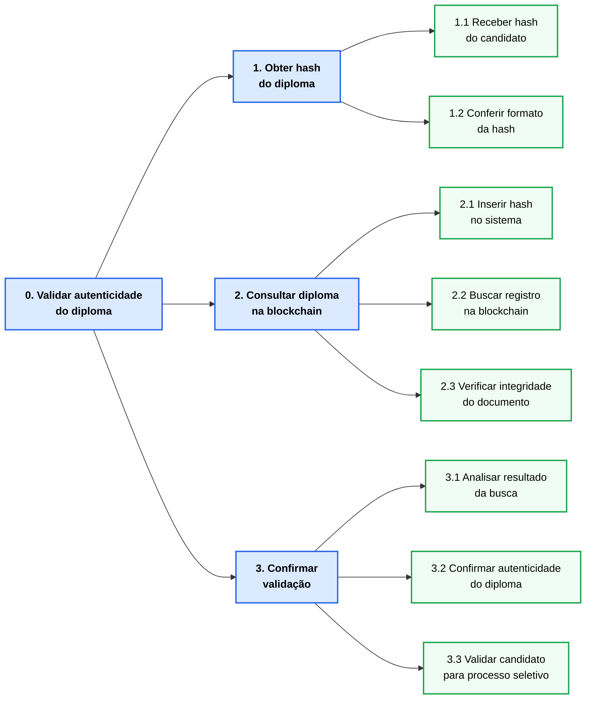
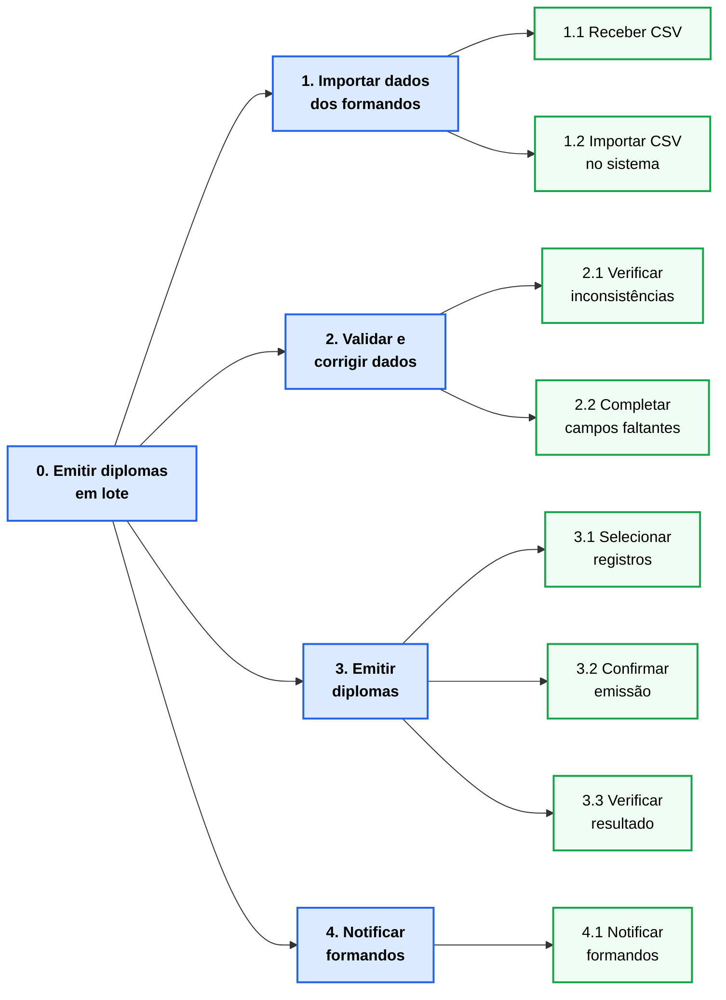

# Modelo Conceitual

---

## 1. Cenários de Interação

> **Nota:** trechos em **negrito** indicam as alterações em relação ao Cenário de Problema correspondente.

---

### Cenário de Interação — Validação de Diplomas
**Persona:** Ana Carolina Ferreira (Recrutadora/Empresa Verificadora), Lucas Mendes (Estudante/Recém-Formado)
**Responsável:** Thales Clemente Pasquotto

**Atores:** Ana Carolina Ferreira (Recrutadora/Empresa Verificadora)

Ana Carolina Ferreira atua como analista administrativa responsável pela validação de diplomas em uma instituição/empresa. Em um determinado momento, ela recebe no sistema uma nova solicitação feita por uma recrutadora, que deseja validar o diploma de graduação do Lucas Mendes para utilizá-lo em processos profissionais. Lucas providenciou o diploma em formato PDF e informou a hash de verificação do documento, enviando tudo para análise.

Ao receber a solicitação, Ana Carolina acessa os dados submetidos e inicia o processo de validação. Primeiro, ela verifica a integridade do arquivo por meio da hash fornecida, garantindo que o documento não foi adulterado. Em seguida, consulta a base de dados da instituição de ensino responsável pela emissão do diploma para confirmar sua autenticidade. Após isso, compara as informações preenchidas por Lucas, como nome completo, curso e data de conclusão, com os dados presentes no documento enviado.

Caso encontre alguma inconsistência, como divergência na data de conclusão ou erro no nome, Ana Carolina entra em contato com Lucas, solicitando a correção das informações ou o reenvio do documento adequado. Lucas, então, revisa os dados e submete novamente suas informações.

Com todas as informações corretas e validadas, Ana Carolina finaliza o processo aprovando o diploma. Após isso, Lucas está apto a seguir no processo seletivo do qual ele faz parte.

---

### Cenário de Interação — Emissão de Diplomas em Lote
**Persona:** Maria Eduarda Santos (Analista de Emissão de Diplomas)
**Responsável:** Leandro de Brito Alencar

**Atores:** Maria Eduarda Santos (analista de emissão de diplomas) e Secretaria Acadêmica

Na segunda-feira seguinte à colação de grau de dezembro, Maria Eduarda Santos precisa cadastrar e emitir os diplomas digitais dos 238 alunos que colaram grau na sexta-feira anterior. **O sistema a notifica que um novo arquivo de formandos está disponível para importação, enviado pela secretaria acadêmica.** Maria sinaliza ao sistema sua intenção de realizar uma emissão em lote e fornece o arquivo recebido.

**O sistema analisa imediatamente a estrutura e o conteúdo do arquivo, verificando compatibilidade de formato e campos obrigatórios. O sistema informa o resultado da análise: 236 registros estão válidos e 2 apresentam inconsistências — um nome com caracteres inválidos e uma data de nascimento incoerente — descrevendo claramente o problema em cada caso.** O sistema pergunta como Maria deseja prosseguir. Maria instrui o sistema a **separar os dois registros inconsistentes em uma fila de pendências** e continuar com os 236 válidos.

**O sistema apresenta um resumo consolidado da emissão: quantidade de diplomas por curso, período de conclusão e os dados que serão registrados na blockchain, permitindo que Maria revise antes de confirmar.** Maria confere o resumo e confirma a operação. **O sistema informa o progresso do processamento a cada conjunto de registros concluído na blockchain.**

Ao finalizar, **o sistema exibe um relatório completo: 236 diplomas emitidos com sucesso, hash de registro de cada um, e o status dos 2 registros pendentes com a indicação exata do campo que precisa ser corrigido.** **O sistema então realiza automaticamente o envio de notificações aos 236 formandos com diploma disponível, e Maria acompanha o status de entrega de cada notificação diretamente no sistema.**

Para os 2 registros pendentes, **Maria acessa a fila de pendências, corrige os dados diretamente no sistema com base nas orientações exibidas** e instrui o sistema a emitir os diplomas restantes. **O sistema processa e notifica os 2 formandos restantes, encerrando o processo com todos os 238 diplomas emitidos e todos os formandos notificados.**

---

*(Cenário 3 — João Paulo)*

---

## 2. Design Centrado na Comunicação

### Nome do Cenário: Validação de Diploma Individual  
**Persona:** Ana Carolina Ferreira | **Responsável:** Thales Clemente Pasquotto  

| Tópico > Subtópico | Falas e Signos |
|:---|:---|
| receber solicitação | D: Nova solicitação de validação de diploma recebida para o candidato Lucas Mendes. Deseja iniciar a análise? |
| | U: Sim, quero verificar a autenticidade do diploma enviado pela hash. |
| | D: Hash verificada com sucesso. O documento apresenta indícios de alteração. |
| | U: Solicitar documento correto ao candidato. |
| reenvio de dados | U: Vou realizar nova validação. |
| aprovação | D: Hash verificada com sucesso. O documento não apresenta indícios de alteração. |
| status final | U: Candidato aprovado. |

### Nome do Cenário: Emissão em Lote e Validação de Dados
**Persona:** Maria Eduarda Santos | **Responsável:** Leandro de Brito Alencar

| Tópico > Subtópico | Falas e Signos |
|:---|:---|
| cadastrar lote | U: Preciso registrar e emitir os diplomas digitais para a turma de formandos deste semestre. |
| > fornecer dados | D: Por favor, forneça o arquivo com os dados dos formandos. Aqui está o modelo de formato esperado. |
| | U: Aqui está o arquivo com a lista dos formandos. |
| > validar dados | D: Analisei os dados fornecidos. Encontrei 236 registros válidos e 2 com inconsistências: registro 47 — nome com caracteres inválidos; registro 183 — data de nascimento incoerente. Como deseja prosseguir? |
| > resolver pendências | U: Quero processar agora apenas os 236 válidos. Os dois com inconsistência ficam na fila de pendências para eu corrigir depois. |
| > revisar e confirmar | D: Entendido. Aqui está o resumo da emissão: 236 diplomas distribuídos em 4 cursos, com os dados que serão registrados na blockchain. Posso iniciar o registro definitivo? |
| | U: Tudo conferido. Pode registrar. |
| > processar | D: Registrando diplomas na blockchain… 25% concluído… 50%… 75%… Concluído. 236 diplomas emitidos com sucesso. 2 registros permanecem na fila de pendências: o campo a corrigir em cada um está indicado no relatório. |
| > notificar | D: Posso enviar automaticamente as notificações de disponibilidade do diploma para os 236 formandos? |
| | U: Sim, pode enviar. |
| > status de envio | D: Notificações enviadas. Aqui está o relatório de entrega: 235 com sucesso, 1 com falha (e-mail inválido — aluna Fernanda Oliveira). Recomendo atualizar o e-mail no cadastro acadêmico e reenviar. |
| resolver pendências | U: Quero corrigir e emitir os 2 diplomas pendentes agora. |
| > corrigir dados | D: Aqui estão os 2 registros pendentes com os campos a corrigir destacados. Faça as alterações necessárias e confirme. |
| | U: Corrigi os dados. Pode emitir e notificar. |
| | D: Diplomas dos 2 formandos emitidos e notificações enviadas. O processo de emissão desta turma está concluído: 238 diplomas emitidos, 238 formandos notificados. |

*(Tabela 3 — João Paulo)*

---

## 3. Mapa de Objetivos

### Ana Carolina Ferreira — Validação de Diploma por Hash
**Responsável:** Thales Clemente Pasquotto

### Maria Eduarda Santos — Analista de Emissão de Diplomas
**Responsável:** Leandro de Brito Alencar

*Mapa 3 — João Paulo | Diagrama consolidado a incluir após os três)*

---

## 4. Esquema Conceitual de Signos

> **Nota:** tabelas de signo, conteúdo/restrição e prevenção/recuperação unificadas em uma única tabela por grupo.
> **Legenda de prevenção/recuperação:** PP = Prevenção Passiva · PA = Prevenção Ativa · RA = Recuperação Apoiada · CE = Captura de Erro

> **Nota:** tabelas de signo, conteúdo/restrição e prevenção/recuperação unificadas em uma única tabela por grupo.  
> **Legenda de prevenção/recuperação:** PP = Prevenção Passiva · PA = Prevenção Ativa · RA = Recuperação Apoiada · CE = Captura de Erro  

### Ana Carolina Ferreira — Validação de Diploma por Hash  
**Responsável:** Thales Clemente Pasquotto  

---

**HS — Hash do Diploma**

| Signo | Origem | Tipo de conteúdo | Restrição | Valor default | Prevenção | Recuperação |
|:---|:---|:---|:---|:---|:---|:---|
| Hash do diploma | Domínio | Texto hexadecimal (256 bits) | Não nulo; deve seguir padrão hexadecimal válido; tamanho fixo | — | PP: instrução de formato esperado · PA: valida caracteres hexadecimais (0-9, a-f) | RA: alerta de hash inválida com indicação do erro · CE: "Verifique a hash informada e tente novamente" |
| Formato da hash | Aplicação | Texto | Deve conter apenas caracteres hexadecimais; sem espaços | — | PA: bloqueia caracteres inválidos durante digitação | RA: mensagem destacando caracteres inválidos |

---

**CB — Consulta na Blockchain**

| Signo | Origem | Tipo de conteúdo | Restrição | Valor default | Prevenção | Recuperação |
|:---|:---|:---|:---|:---|:---|:---|
| Entrada de hash para busca | Aplicação | Texto | Deve corresponder a uma hash válida previamente registrada | — | PP: campo obrigatório (*) | RA: alerta se nenhum registro for encontrado |
| Registro do diploma | Aplicação | Estrutura de dados | Deve existir na blockchain para validação positiva | — | PP: feedback visual de busca em andamento | RA: mensagem "Diploma não encontrado na base" |
| Status da consulta | Aplicação | Enumeração (Encontrado / Não encontrado / Erro) | Gerado automaticamente | Não encontrado | PP: indicador de processamento | RA: mensagem clara do resultado da busca · CE: "Erro na consulta. Tente novamente" |

---

**VD — Validação do Diploma**

| Signo | Origem | Tipo de conteúdo | Restrição | Valor default | Prevenção | Recuperação |
|:---|:---|:---|:---|:---|:---|:---|
| Integridade do diploma | Aplicação | Booleano (Íntegro / Inválido) | Baseado na correspondência exata da hash | — | PA: validação automática da hash com o registro | RA: indicação de possível adulteração do documento |
| Autenticidade do diploma | Aplicação | Booleano (Autêntico / Não autêntico) | Depende da existência do registro na blockchain | — | PP: só permite validação se registro existir | RA: mensagem de diploma não autenticado |
| Resultado da validação | Aplicação | Enumeração (Válido / Inválido) | Gerado automaticamente após análise | Inválido | PP: resumo do resultado ao final da consulta | RA: orientação de reprovação do candidato em caso inválido |

---

**RS — Resultado para Processo Seletivo**

| Signo | Origem | Tipo de conteúdo | Restrição | Valor default | Prevenção | Recuperação |
|:---|:---|:---|:---|:---|:---|:---|
| Status do candidato | Domínio | Enumeração (Apto / Não apto) | Baseado no resultado da validação | Não apto | PP: regra clara de aprovação baseada na autenticidade | RA: indicação de reprovação caso diploma inválido |
| Decisão da recrutadora | Domínio | Ação | Deve seguir o resultado da validação | — | PP: alinhamento com política de validação | RA: revisão manual em caso de dúvida |

---

### Maria Eduarda Santos — Analista de Emissão de Diplomas
**Responsável:** Leandro de Brito Alencar

---

**IM — Importação de Dados**

| Signo | Origem | Tipo de conteúdo | Restrição | Valor default | Prevenção | Recuperação |
|:---|:---|:---|:---|:---|:---|:---|
| Arquivo de formandos | Domínio | Arquivo (CSV) | Não nulo; deve conter todas as colunas obrigatórias no formato definido | — | PP: descrição do formato esperado antes do envio | RA: lista das colunas ausentes ou com formato incorreto · CE: "Exporte novamente do SIGA utilizando o modelo disponível" |
| Quantidade de registros importados | Aplicação | Número inteiro | ≥ 1 | — | PP: confirmação da quantidade antes de prosseguir | RA: alerta se nenhum registro for reconhecido |

---

**DF — Dados do Formando**

| Signo | Origem | Tipo de conteúdo | Restrição | Valor default | Prevenção | Recuperação |
|:---|:---|:---|:---|:---|:---|:---|
| Nome completo | Domínio | Texto | Não nulo; apenas caracteres alfabéticos e acentuação | — | PP: campo obrigatório (*) · PA: rejeita caracteres inválidos | RA: destaca o campo e indica o caractere inválido |
| CPF | Domínio | Número (11 dígitos) | Não nulo; dígitos verificadores válidos; único no lote | — | PP: máscara de formatação (___.___.___-__) · PA: bloqueia letras e símbolos | RA: alerta de CPF inválido ou duplicado com destaque no registro |
| Data de nascimento | Domínio | Data (DD/MM/AAAA) | Não nula; data válida; anterior à data atual | — | PP: máscara de data · PA: bloqueia valores impossíveis (ex: mês 13) | RA: alerta de data inválida ou incoerente com a idade esperada |
| Data de ingresso | Domínio | Data (DD/MM/AAAA) | Não nula; anterior à data de conclusão | — | PP: campo obrigatório (*) | RA: alerta de inconsistência temporal com a data de conclusão |
| Data de conclusão | Domínio | Data (DD/MM/AAAA) | Não nula; posterior à data de ingresso | — | PP: campo obrigatório (*) · PA: bloqueia data anterior ao ingresso | RA: alerta de inconsistência temporal com destaque dos dois campos |
| Curso | Domínio | Seleção (lista fechada) | Não nulo; deve corresponder a curso cadastrado na instituição | — | PP: apresenta apenas cursos cadastrados | RA: alerta se o valor do CSV não corresponder a nenhum curso |
| Habilitação | Domínio | Texto | Não nulo | — | PP: campo obrigatório (*) | RA: alerta de campo em branco |
| Turno | Domínio | Seleção (Matutino / Vespertino / Noturno / Integral) | Não nulo | — | PP: seleção fechada com as opções válidas | RA: alerta se valor importado não corresponder às opções |
| Matrícula | Domínio | Texto alfanumérico | Não nula; única por instituição e lote | — | PP: campo obrigatório (*) | RA: alerta de matrícula duplicada no lote com destaque dos registros conflitantes |
| E-mail | Domínio | Texto (formato e-mail) | Não nulo; deve conter "@" e domínio válido | — | PP: validação de formato durante importação · PA: sinaliza formato inválido antes da emissão | RA: destaca os registros com e-mail inválido · CE: "Atualize o e-mail no cadastro acadêmico antes de notificar" |

---

**EM — Emissão na Blockchain**

| Signo | Origem | Tipo de conteúdo | Restrição | Valor default | Prevenção | Recuperação |
|:---|:---|:---|:---|:---|:---|:---|
| Lote de emissão | Aplicação | Conjunto de registros | Mínimo 1 registro; todos os campos obrigatórios preenchidos e válidos | — | PP: resumo do lote com contagem e distribuição por curso antes da confirmação | RA: impede confirmação se houver campos obrigatórios em branco |
| Hash do diploma | Aplicação | Texto hexadecimal (256 bits) | Gerado automaticamente; imutável após registro | — | PA: campo somente leitura, não editável pelo usuário | CE: "Falha no registro blockchain. Tente novamente ou acione o suporte técnico" |
| Status de emissão por registro | Aplicação | Enumeração (Emitido / Falha / Pendente) | Gerado automaticamente ao final do processamento | Pendente | PP: indicador de progresso durante o processamento | RA: relatório final listando cada registro com falha, o campo problemático e a ação sugerida |

---

**NO — Notificação dos Formandos**

| Signo | Origem | Tipo de conteúdo | Restrição | Valor default | Prevenção | Recuperação |
|:---|:---|:---|:---|:---|:---|:---|
| Status de notificação por formando | Aplicação | Enumeração (Enviado / Falha / Pendente) | Gerado automaticamente após envio | Pendente | PP: resumo de destinatários antes do envio em massa | RA: lista de falhas de entrega com orientação de reenvio ou atualização de cadastro |
| Link de acesso ao diploma | Aplicação | URL | Gerado automaticamente; único por diploma; válido enquanto o registro existir na blockchain | — | PA: link gerado apenas após emissão bem-sucedida | CE: "Diploma não encontrado. Verifique se a emissão foi concluída com sucesso" |

*(Esquema 2 — Thales | Esquema 3 — João Paulo)*
